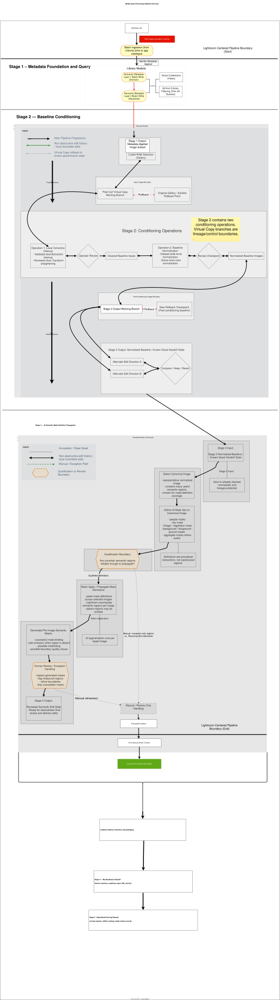

# Media Asset Processing Pipeline

A staged media asset processing system that turns GUI-based, ad hoc photo
editing work into evidence-backed workflow infrastructure, reducing
solo-operator overhead while supporting review, operational serving, and
downstream ML readiness.



<br>

## Executive Summary

The repository models the workflow as a reproducible, multi-stage
system with explicit boundaries, non-destructive state transitions, and
validation checkpoints. Even when executed inside GUI-based tools, the
workflow is designed with production system qualities rather than an ad
hoc editing sequence.

The core engineering pattern is deterministic orchestration around
uncertain inputs: creative image variance from heterogeneous capture
conditions, and probabilistic semantic segmentation behavior from AI
masking tools.

Across the documented stages, the project demonstrates how ingest-time
metadata application, image normalization, and semantic masking can be
composed into a deterministic workflow that scales more reliably than
repeated manual editing.

<br>

## AI-Assisted Engineering

This repository was developed with AI coding assistance alongside manual
Lightroom workflow work. Human review, validation, and evidence capture were
used to evaluate where agent behavior aligned with—or drifted from—the
intended engineering rules.

See the [Agent Instruction-Output Alignment Gap](docs/case-studies/agent-instruction-output-alignment-gap.md)
case study for one documented example.

<br>

## Problem

Creative production workflows often accumulate as several informal, ad hoc editing
habits inside GUI tools, making them hard to reproduce, audit, and
scale across large image datasets. Without explicit stage boundaries and
validation checkpoints, small inconsistencies can compound via operator drift causing laborous rework. Weak rollback safety then makes those inconsistencies more costly to contain once they spread through the working set.

The core systems problem is therefore not only how to optimally perform isolated
editing operations, but how to organize them into a stable pipeline
that remains batch-safe under real tooling limitations, heterogeneous
creative input data, and AI-assisted operations (auto-masking) with partial,
non-binary failure modes.

<br>

## Solution Overview

The workflow addresses that problem through five documented stages:

1. Metadata Foundation and Query
2. Baseline Conditioning
3. AI Semantic Mask Definition Propagation
4. ML-Readiness Handoff
5. Operational Serving Exports

Each stage isolates a specific class of transformations, defines clear
inputs and outputs, and introduces validation boundaries before later
operations are applied. The result is a workflow that is more
deterministic, easier to reason about, and safer to evolve over time.

The stages build a reliability layer around increasingly uncertain
workflow surfaces: Stage 1 establishes deterministic metadata state,
Stage 2 controls visual variance introduced by capture conditions,
Stage 3 constrains probabilistic AI mask outputs through qualification,
bounded propagation, and human review, and Stage 4 packages the
resulting evidence into an honest ML-readiness handoff. Stage 5 then
publishes compact serving exports and loader-facing contracts for
downstream operational consumers.

The pipeline does not replace the final manual editing pass. It prepares
a cleaner, normalized, review-bounded working set so obligatory manual
refinement and final artistic touches happen later with less repeated
effort.

<br>

## Key Constraints

Across the documented stages, the shared engineering constraints and
design themes are:

- stage-bounded workflow design
- deterministic orchestration around heterogeneous creative inputs
- batch-safe operations under tooling constraints
- bounded handling of probabilistic outputs
- reproducibility through clear validation checkpoints
- human review at defined boundaries

<br>


> [!IMPORTANT]
> **Read the shared terminology first.** This repository uses
> project-specific workflow vocabulary such as `gallery`,
> `reference image`, and `canonical image` in narrow, technical ways.
> Open [docs/terminology.md](docs/terminology.md) in a separate tab
> before reading the stage writeups if you want the later diagrams and
> handoff language to make sense on first pass.

<br>

### Stage 1 – Metadata Foundation and Query

Establishes the metadata and query foundation for the workflow.

Location: [Stage 1](pipeline_stages/001_metadata-foundation-and-query/README.md)

Focus areas:
- deterministic ingest behavior under single-preset constraints
- non-destructive metadata enrichment through non-overlapping field assignments
- metadata-driven indexing and retrieval patterns enabling rapid
  ad-hoc queries, declarative views, and downstream discoverability
- stable metadata state before subjective culling or image transformation begins

- **Identity initialization:** Single-preset ingest establishes the protected authorship baseline
- **Semantic enrichment:** Post-import presets and keywords add non-overlapping descriptive metadata
- **Query layer:** Filter-based retrieval and Smart Collections derive reusable views over image records


> **Interstage gate:** after Stage 1, the operator culls the full image
> set into the working set that enters Stage 2. Culling is primarily a
> visual and editorial judgment step, while Stage 1 ensures the selected
> assets already carry stable identity metadata, keyword context, and
> queryable catalog state.
>
> **Handoff state:** Stage 2 receives a selected working set whose
> metadata and descriptive context were established before visual
> conditioning begins.

<br>

### Stage 2 – Baseline Conditioning

Establishes the conditioned image baseline for downstream semantic
operations.

Location: [Stage 2](pipeline_stages/002_baseline-conditioning/README.md)

Focus areas:
- local corrective cleanup and dataset-wide tonal normalization across heterogeneous images
- scene-level color normalization that preserves natural hue differences across scenes
- virtual copies for rollbackable experimentation while reducing operator cognitive load
- deterministic conditioning around creative/capture variance from changing light, scene, and camera conditions

- **Input lineage protection:** Initial virtual-copy branching protects
  the culled working set from the original RAW selection
- **Operation 1:** Local corrective cleanup
- **Operation 2:** Dataset-wide tonal normalization with
  scene-level color normalization
- **Output lineage protection:** Post-conditioning virtual-copy
  branching preserves the normalized baseline as a known-good handoff
  state

> **Handoff state:** Stage 3 receives a cleaned, normalized, and
> lineage-protected working state rather than unresolved luminance and
> color variance.

<br>

### Stage 3 – AI Semantic Mask Definition Propagation

Applies semantic mask definitions across the conditioned working set and
introduces bounded review around probabilistic AI output.

Location: [Stage 3](pipeline_stages/003_ai-semantic-mask-definition-propagation/README.md)


Focus areas:
- procedural mask definitions propagated across datasets rather than copying pixel regions
- dataset-scale application of AI-generated semantic masks to batch edit operations
- qualitative evaluation of mask quality and workflow reliability against manual editing results
- deterministic review boundaries around probabilistic AI segmentation behavior

- **Semantic operations:** Batch AI masking
- **Qualification:** Semantic definitions are qualified before broad propagation
- **Human review:** Manual refinement pass

> **Boundary:** qualification and review separate propagated semantic
> candidates from accepted downstream corrections.
>
> **Handoff state:** the working set carries propagated, review-bounded
> semantic masks forward into final manual refinement rather than
> requiring full local masking from scratch.

<br>

### Stage 4 – ML-Readiness Handoff

Packages the staged evidence into a feature inventory, readiness report,
and handoff contract for a hypothetical ML/data-science team.

Location: [Stage 4](pipeline_stages/004_ml-readiness-handoff/README.md)

Focus areas:
- cross-stage feature inventory joined by `asset_key`
- RAW pixel-signal metrics as source-image evidence
- explicit model-training prerequisites and scope boundaries
- compact manifest for employer-facing review

> **Boundary:** Stage 4 packages current evidence for ML discovery and
> identifies the next artifacts required before modeling work begins.

<br>

### Stage 5 – Operational Serving Exports

Converts the Stage 1-4 evidence chain into compact serving exports for
downstream operational consumers.

Location: [Stage 5](pipeline_stages/005_operational-serving-exports/README.md)

Focus areas:
- asset, feature-family, and artifact-catalog serving exports
- manifest-backed provenance for downstream loading
- cloud-loader contract for S3 serving exports and DynamoDB status
  records
- clear boundary between local export generation and later cloud loader
  compute

> **Boundary:** Stage 5 publishes compact, loadable export surfaces
> without replacing the detailed stage artifacts they summarize.

<br>

## Reading Paths

Readers will usually benefit from taking one of two paths through the
repository depending on how deeply they want to inspect the stage
evidence and implementation surfaces.

### Quick Path (15 mins)

Use this path if you want a condensed, high-level view of the project:

1. [README](README.md)
2. [Shared terminology](docs/terminology.md)
3. [Batchability Cost Model](docs/batchability-cost-model.md)
4. [Stage 1](pipeline_stages/001_metadata-foundation-and-query/README.md):
   scan governing principles and read the nearby demonstration text
5. [Stage 2](pipeline_stages/002_baseline-conditioning/README.md):
   scan governing principles and read the nearby demonstration text
6. [Stage 3](pipeline_stages/003_ai-semantic-mask-definition-propagation/README.md):
   scan governing principles and read the nearby demonstration text
7. [Stage 4](pipeline_stages/004_ml-readiness-handoff/README.md)
8. [Stage 5](pipeline_stages/005_operational-serving-exports/README.md)
9. [Scripts](scripts/python/README.md), [Outputs](outputs/README.md),
   and [Tests](tests/README.md)
10. [Terraform](infra/terraform/aws-centralized-assets/README.md)

### Extensive Path (30 mins)

Use this path if you want the fuller systems-design argument,
implementation rationale, and downstream operational context:

1. [README](README.md)
2. [Shared terminology](docs/terminology.md)
3. [Product Requirements](docs/product-requirements.md)
4. [Pipeline Overview Diagram](docs/diagrams/source/media-asset-processing-pipeline-overview-diagram.drawio)
5. [Batchability Cost Model](docs/batchability-cost-model.md)
6. [Stage 1](pipeline_stages/001_metadata-foundation-and-query/README.md):
   read the problem, governing principles, implementation, and takeaway
7. [Stage 2](pipeline_stages/002_baseline-conditioning/README.md):
   read the problem, governing principles, implementation, validation,
   and takeaway
8. [Stage 3](pipeline_stages/003_ai-semantic-mask-definition-propagation/README.md):
   read the problem, governing principles, qualification flow,
   validation examples, and takeaway
9. [Stage 4](pipeline_stages/004_ml-readiness-handoff/README.md)
10. [Stage 5](pipeline_stages/005_operational-serving-exports/README.md)
11. [Scripts](scripts/python/README.md), [Outputs](outputs/README.md),
    and [Tests](tests/README.md)
12. [Terraform](infra/terraform/aws-centralized-assets/README.md)
13. [Cloud Loader Contract](docs/cloud/stage5-loader-contract.md)
14. [Architecture Decision Records](docs/adr)
15. [Future Work](docs/future-work)

<br>

## Project Structure and Evidence

The project has two complementary surfaces:

The pipeline has five domain stages that describe how media assets are
transformed. A cross-stage evidence and control layer operates across those
stages, extracting state, validating transitions, preserving lineage, and
packaging outputs for ML-readiness and operational serving.

```text
Stage 1 ─── Stage 2 ─── Stage 3 ─── Stage 4 ─── Stage 5
   ╲          ╲          ╲          ╲          ╲
    └──── Cross-Stage Evidence and Control Layer ────┘
```

1. **Workflow System Design and Operation** — Stages 1–3 document the
   Lightroom-centered workflow, its transformation boundaries, manual review
   points, rollback behavior, and governing principles.

2. **Evidence, Handoff, and Serving** — Stages 4–5, supported by the repository
   scripts and tests, extract structured state, validate outputs, generate
   manifests, produce ML-readiness handoffs, and package operational serving
   exports.

The scripts and tests make the workflow inspectable and reproducible without
claiming to replace Lightroom. This repository augments Adobe Lightroom rather
than functioning as a standalone packaged application.

The project’s claims are supported by two evidence modes:

- **Workflow evidence:** stage prose, workflow images, operational notes, and
  experiments explain why the boundaries, review points, and design patterns
  exist.
- **Executable evidence:** scripts, tests, manifests, validation reports,
  handoff contracts, and serving exports make the resulting state inspectable
  and operationally testable.

These artifacts support workflow-behavior and solo-operator-efficiency claims
while exposing assumptions for downstream operational or ML/data-science
evaluation. They are not controlled benchmarks or universal performance claims.
