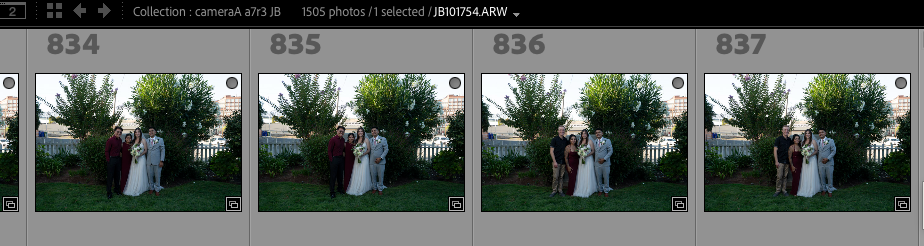
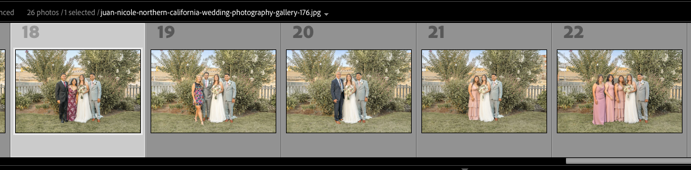
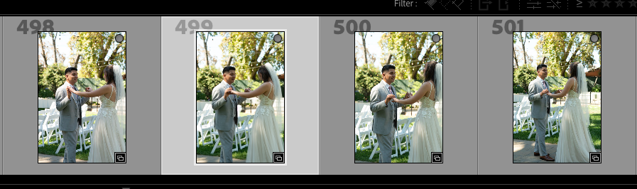

# stage 2 batch normalization  
  
A couple realizations regardlng the flaws of my normalization stage (stage 2):  
  
1. After reviewing RAW photos across several scenes, the foilage consistency is stronger than I anticipated. My lived experience editing the photos with minimal batch work made me — arguably deceivingly — believe that my repeated manual foilage editing was an unavoidable consequence of the initial state and dynamics of RAW capture, when in reality, just highlights why batch processing is necessary. Although this may be convoluted by a different, orthogonal layer related to the optimal sequence of editing, where perhaps, global editing first is what caused the foilage hue divergence (human operator mistake), in which batch normalization should have occurred first, even before simple exposure adjustments — and to a lesser degree — all other tonal changes). This is supported largely by the face that the RAW images paint the same picture for skin tone. The groom’s skin tone is rather consistent across the entire wedding day with varying ambient exposure, but my final gallery reveals — both in final picture state AND per-image history — that I, the human operator — struggled to effectively revert the damage I had done, again because of my improper sequence of edits applied.   
  
  
Figure 1A and 1B — Original Foilage Normalization Reasoning Negated
1A: we see proof that the raw group portrait foliage was consistently green all along.  
1B: consistent too, but doesnt show the struggle i faced as an operator repeatedly trying to match one another’s precice green pallete once decided, of which i dont have proof of anyways since these photos were edited in a catalogue that has since been corrupted and non-recoverable.   
  
  
2. Differences in, say tree line foilage color and natural grass is different and one could argue that it would benefit from changes but more-so from an aesthetic desire, which again muddies the boundary between subjective artistic intent and objective processing needs. In addition, the question of normalization becomes less apparent, especially since each scene accurately preserves the differential. With this being said, I could make the argument that dataset-wide the foilage, whether it is a deep green or if its a yellow-green, both need to be reduced as it draws too much attention from the subjects (people), which may be my best new argumental position after recognizing bullet point 1.   
3.   
  
  
  
To add, certain sectios of stage 2 writeup already sort of address my concern in bullet point 1, particularly section ****## Pipeline Value - In depth****, so maybe i just need a slightly adjustment to my framing.   
