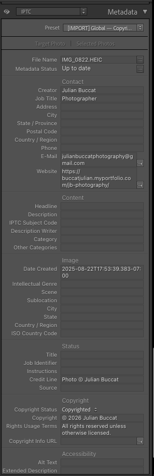

# Production Workflow System Design & Implementation: Metadata Application, Enrichment, and Query Pipeline

Part of the **Creative Workflow Batch Transformation Pipeline** umbrella project.

<br>

## Executive Summary

This stage establishes a safe metadata foundation for downstream image
workflow operations. Because ingest supports only a single metadata
preset, the workflow establishes a stable identity baseline first, then
applies semantic enrichment post-import without overwriting ownership
fields. The result is a metadata model that is auditable, scalable
across multiple classification domains, and useful for downstream
retrieval through ad-hoc filtering and Smart Collections. Operationally,
this improves internal organization and retrieval while producing structured
semantic metadata that could later support analytics, search, or machine-learning workflows.

Within the larger pipeline, Stage 1 is the deterministic state layer:
it makes image records identifiable, queryable, and safe to enrich
before later culling, visual conditioning, or AI-assisted operations
introduce more subjective and probabilistic decision points.

<br>

## Problem

Metadata application during ingest is constrained by Lightroom's
single-preset import model. That makes it easy to initialize ownership
metadata consistently, but risky to mix protected identity fields with
later semantic enrichment fields in the same write path.

The core challenge is to maintain a stable, authoritative identity
state while enabling iterative, revisable semantic enrichment. Poorly
structured metadata increases rework, weakens retrieval, and reduces
the downstream usefulness of image records for curation, publishing,
discoverability, and later pipeline stages.

This stage intentionally resolves the most deterministic part of the
system first. Later stages operate on visually variable images and
AI-derived semantic outputs; Stage 1 ensures those later transformations
remain anchored to stable source records and retrievable metadata.

<br>

## Solution Overview

The workflow separates metadata into a protected identity layer and a
revisable semantic layer. A single import preset establishes the
ownership baseline at ingest, while domain-specific semantic presets are
applied only after import with non-overlapping field writes. Keywords
are also managed post-ingest so classification remains deliberate and
incremental. Once enriched, the metadata supports query-driven
retrieval, including Smart Collections treated as declarative views over
image records.

<br>

## Key Constraints

- ingest supports only one metadata preset; there is no native preset stacking
- Lightroom provides no field-level locking for protected metadata fields
- post-import presets remain safe only when checked-field writes do not overlap
- metadata presets can overwrite existing values when the same checked fields are reused
- export controls are reductive (include/exclude), not additive

Because the tool does not provide native field isolation, the workflow
enforces write isolation through schema design: the ingest preset owns
the identity fields, while later semantic presets write only to
non-overlapping semantic fields.

<br>

## Technical Design & Implementation

<br>

### Separation of Concerns

- **Identity Layer**: protected, authoritative ownership/authorship state initialized at ingest.
- **Semantic Layer**: mutable, revisable classification/context state enriched post-ingest.
- **Query Layer**: declarative logical views derived from metadata predicates (Smart Collections).

```text
RAW Image
   ↓
[Copyright & Creator Import Preset]
   ↓
Identity Layer (Protected)

   ↓ (post-import)
[Domain Presets]
   ↓
Semantic Layer (Mutable)

   ↓
[Smart Collections]
   ↓
Derived Logical Views
```

<br>

### Implementation Details

<br>

#### 1) Single Global Import Preset (Authoritative)

**Metadata Preset name:** `[IMPORT] Global Copyright & Creator`

Included identity fields:
- IPTC Copyright
- Copyright Status
- Rights Usage Terms
- Creator Name
- Creator Email
- Creator Website
- Creator Job Title
- Credit Line

Excluded fields:
- Caption
- Headline
- IPTC Category
- Keywords
- Accessibility Alt Text
- Domain-specific descriptions



<br>

#### 2) Domain-Specific Presets (Post-Import Only)

**Metadata Preset name(s):**

`Graduation — CSU Sacramento` | `Wedding` | `Marketing`

Domain presets are semantic enrichment presets applied after ingestion.

- All identity/authorship/copyright fields are unchecked.
- Only semantic fields are checked.
- Example semantic fields: Caption, Headline, IPTC Category, Accessibility Alt Text, contextual descriptions.

![Authoritative metadata protected with additional domain-relevant metadata written from preset 'Wedding' without losing metadata written from previous preset `[IMPORT] Global Copyright & Creator` with additional fields added such as x, y, and z](assets/images/copright-domain-layered-writes.png)

<br>

#### 3) Keywords Managed Separately

Keywords are intentionally excluded from the global ingest preset.
- Taxonomy evolves incrementally as the culled image set is reviewed and
  the keyword hierarchy is refined over time.
- Keyword assignment is explicit and post-ingest (Keyword List/Keyword Sets or semantic presets).
- This preserves deliberate classification rather than implicit ingest-time tagging.

##### Keyword Tags, Keyword Sets, and Keyword Lists

Keyword Lists function as hierarchical taxonomies for scalable
semantic metadata management.

![Keyword panel interface showing keyword hierarchy with parent and child keyword entries with relevant keywords selected as indicated by the [insert ASCII white checkmark symbol]](assets/images/keyword-list.png)

<br>

## Verification (Critical)

<br>

### During Import

1. Apply only `[IMPORT] Global Copyright & Creator` during ingest.

<br>

### After Import

1. Review 1-2 sample images from the ingested batch in the Library
   module.
2. Switch the metadata panel to **IPTC**.
3. Validate identity fields are populated (copyright + creator fields).
4. Validate semantic/classification fields are still empty.

<br>

### After Applying One Domain-Specific Semantic Preset

1. Re-check the metadata panel in **IPTC**.
2. Validate semantic fields are now populated.
3. Validate identity fields *remain unchanged* from ingest baseline.
4. Confirm resulting state is additive and non-destructive.

<br>

## Guiding Principle

> **Authorship metadata should be automatic and irreversible.**
> **Semantic metadata should be deliberate and revisable.**

<br>

## Downstream Querying — Exploratory Queries (Library Filtering) and Declarative Views (Smart Collections)

<br>

### Two Query Modes

After establishing a repeatable metadata schema strategy, the catalog
supports two distinct query modes:

- **Library Filtering** = exploratory, one-off queries over catalog metadata
- **Smart Collections** = saved declarative views over the same metadata store

Both depend on the same enriched metadata foundation. The difference is
whether the query is transient or saved for repeated reuse.

<br>

### Systems Framing

Smart Collections can be understood as a query and indexing layer over
stable metadata-backed source records, not just as an organizational UI
feature. This makes their behavior more legible in systems terms.

<br>

### Conceptual Model

- Photos = source records
- Metadata fields (ratings, flags, keywords, dates, capture attributes) = structured columns
- Library filtering = exploratory one-off queries
- Smart Collections = saved predicates / declarative views

Collections store selection logic, not copies of records. Membership is continuously recomputed as metadata changes, making them functionally similar to views in an RDBMS.

<br>

## Ad‑hoc Library Filtering

The Library Filter bar performs temporary, exploratory metadata queries
against the catalog. Users can filter images based on fields such as:

- Rating
- Flags
- Capture date
- Camera model
- Lens metadata

This mode is useful for one-off investigation and operational review
when the goal is to inspect the catalog from a temporary analytical
angle rather than save a reusable retrieval rule.

<br>

### Example: Exploratory Gear Review

Conceptual SQL equivalent:

```sql
SELECT camera_model, lens_model, COUNT(*) AS strong_images
FROM images
WHERE rating >= 4
GROUP BY camera_model, lens_model;
```

This kind of temporary filtering is useful for exploratory review, such as evaluating which camera body and lens combinations are producing the strongest images.

---
🚧 TODO — EVIDENCE
Type: Visual
Asset: ad_hoc_library_filter_example.png
Purpose: Show a temporary Lightroom Library Filter query over enriched metadata for exploratory retrieval.
---

<br>

## Smart Collections

Smart Collections store reusable selection logic over the enriched
metadata layer. Unlike temporary library filters, they preserve the
query definition itself so the same retrieval rule can be revisited,
reused, and refined over time.

<br>

### Example: Highlights as Derived Dataset

A “Highlights” view can be defined as:
- Rating ≥ 4
- Flag = Pick (retained in the culled working set for downstream editing
  and delivery)
- Capture date range (e.g., 2024, 2025)
- Optional keyword/domain filters (e.g., Events > Wedding > Moments > First kiss)

This produces a highly contextualized derived dataset for downstream review, curation, and portfolio selection.

Conceptual SQL equivalent:

```sql
SELECT *
FROM photo_catalog
WHERE rating >= 4
  AND rejected = false
  AND capture_year IN (2024, 2025)
  AND (
    keyword_path LIKE 'Events > Wedding%'
    OR keyword_path LIKE 'Details > Flower%'
  );
```

The SQL examples in this section are conceptual analogues, not claims
about Lightroom’s literal internal query representation. The catalog may
store rule definitions in SQLite-backed tables, but the system’s
internal execution model is not directly exposed through the GUI.

The point is that Smart Collections behave like saved declarative views
over enriched metadata.

---
🚧 TODO — EVIDENCE
Type: Visual
Asset: smart_collections_example.png
Purpose: Show a Smart Collection configured as a saved declarative view over enriched metadata.
---

<br>

### Why This Matters

- Makes curation logic explicit, inspectable, and reusable.
- Reduces repeated manual filtering during review and selection.
- Turns Smart Collections into a more reliable retrieval layer for ongoing workflow decisions by supplying better structured metadata.

<br>

### Limitations

- No joins across entities
- Limited computed-field expressiveness
- No built-in versioning of query definitions
- No exportable formal schema for rules

<br>

## Engineering Concepts Demonstrated Uniquely in Stage 1

- Deterministic metadata initialization under a single-preset ingest
  constraint
- Identity vs semantic metadata partitioning
- Conflict avoidance between identity and semantic enrichment through non-overlapping metadata field assignments
- Keyword taxonomy management as a separate semantic classification
  layer
- IPTC-panel verification as an operator-visible metadata validation
  checkpoint
- Smart Collections as saved declarative views 
- Ad-hoc library filtering as exploratory one-off querying
