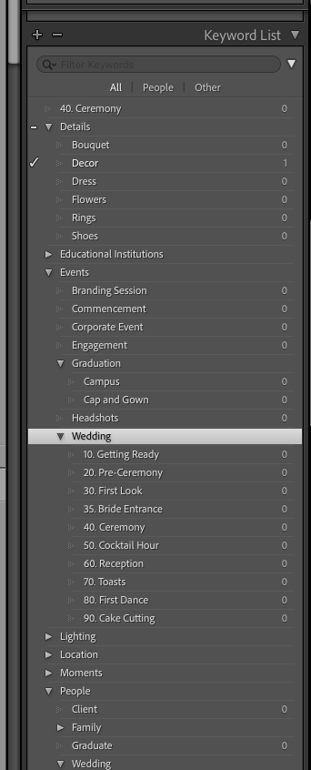

# Case Study: Metadata Ingestion and Enrichment Pipeline

Part of the **Creative Workflow Batch Transformation Pipeline** umbrella project.

## Executive Summary

- **Constraint:** The system/tooling supports only one metadata preset at ingest.
- **Risk:** Metadata collisions occur when multiple presets write the same fields, risking ownership overwrite.
- **Architecture:** Split metadata into a protected Identity Layer and a revisable Semantic Layer.
- **Ingest:** Use a single authoritative preset to establish a stable ownership baseline at ingest.
- **Enrichment:** Apply domain-specific presets post-ingest that write only classification fields.
- **Safety:** Field-level write boundaries prevent overwrites by design, not by operator caution.
- **Validation:** Deterministic IPTC-panel checklist used after ingest and after enrichment.
- **Querying:** Smart Collections are treated as declarative views (saved predicates), not folders.
- **Scalability:** Supports multi-domain classification without changing ingest guarantees.

## Problem Statement

Design a deterministic metadata ingestion and enrichment system for image assets operating under a hard tooling constraint: only one preset may be applied at ingest. The system must reliably initialize ownership metadata, prevent field-level collisions, and remain robust as classification requirements span multiple domains.

The core challenge is to maintain a stable, authoritative identity state while enabling iterative, revisable semantic enrichment. The solution must be non-destructive, auditable, and simple to validate in batch workflows.

## Key Constraints and Observations

- The system/tooling allows only one metadata preset at import, no native preset stacking.
- Post-import presets are additive when checked fields do not overlap.
- Conflicts occur only when two presets write to the same checked fields.
- Export options are reductive (include/exclude), not additive.

## Tooling Limitations

Lightroom provides no field‑level locking and metadata presets can overwrite existing fields if the same fields are checked. Because the system cannot rely on tooling guarantees to protect critical metadata, write isolation is enforced through schema design: each preset writes to a dedicated set of fields, preventing destructive collisions between identity and semantic metadata.


## Architecture

### Separation of Concerns

- **Identity Layer**: protected, authoritative ownership/authorship state initialized at ingest.
- **Semantic Layer**: mutable, revisable classification/context state enriched post-ingest.
- **Query Layer**: declarative logical views derived from metadata predicates (Smart Collections).

```text
RAW Image
   ↓
[Copyright & Creator Import Preset]
   ↓
Identity Layer (Protected)

   ↓ (post-import)
[Domain Presets]
   ↓
Semantic Layer (Mutable)

   ↓
[Smart Collections]
   ↓
Derived Logical Views
```

## Implementation Details

### 1) Single Global Import Preset (Authoritative)

**Metadata Preset name:** `[IMPORT] Global Copyright & Creator`

Included identity fields:
- IPTC Copyright
- Copyright Status
- Rights Usage Terms
- Creator Name
- Creator Email
- Creator Website
- Creator Job Title
- Credit Line

Excluded fields:
- Caption
- Headline
- IPTC Category
- Keywords
- Accessibility Alt Text
- Domain-specific descriptions

This ingest preset establishes the authoritative identity state at ingest. By excluding semantic fields, the design minimizes collision surface area and avoids embedding domain assumptions during ingest.

### 2) Domain-Specific Presets (Post-Import Only)

**Metadata Preset name(s):** `Graduation — CSU Sacramento` | `Wedding`

Domain presets are semantic enrichment presets applied after ingestion.

- All identity/authorship/copyright fields are unchecked.
- Only semantic fields are checked.
- Example semantic fields: Caption, Headline, IPTC Category, Accessibility Alt Text, contextual descriptions.

This enables safe batch enrichment while protecting authoritative metadata from accidental overwrite.

### 3) Keywords Managed Separately

Keywords are intentionally excluded from the global ingest preset.
- Taxonomy evolves incrementally as the culled image set is reviewed and
  the keyword hierarchy is refined over time.
- Keyword assignment is explicit and post-ingest (Keyword List/Keyword Sets or semantic presets).
- This preserves deliberate classification rather than implicit ingest-time tagging.

#### Keyword Tags, Keyword Sets, and Keyword Lists

Keyword Lists function as hierarchical taxonomies for scalable
semantic metadata management.



## Verification (Critical)

**During import**
- Apply only `[IMPORT] Global Copyright & Creator` during ingest.

**After import**
- Review 1-2 sample images from the ingested batch in the Library
  module.
- Switch the metadata panel to **IPTC**.
- Validate identity fields are populated (copyright + creator fields).
- Validate semantic/classification fields are still empty.

**Apply one domain-specific semantic preset to the same sample set post-import**
- Re-check the metadata panel in **IPTC**.
- Validate semantic fields are now populated.
- Validate identity fields *remain unchanged* from ingest baseline.
- Confirm resulting state is additive and non-destructive.

## Results / Benefits

- Single source of truth for identity metadata.
- Zero overwrite risk for ownership fields when boundaries are respected.
- Scalable enrichment workflow across multiple classification domains.
- Explicit, operator-visible classification decisions post-ingest.
- Reproducible metadata outcomes from deterministic initialization + checklist validation.

## Engineering Concepts Demonstrated

- Constraint-driven design
- Separation of concerns
- Deterministic initialization under tooling limits
- Protected identity vs revisable semantic metadata
- Conflict avoidance through non-overlapping field writes
- Post-ingest enrichment pipeline design
- Declarative views / logical indexing
- Non-destructive enrichment when field boundaries are respected
- Auditability through explicit validation steps
- Reproducibility via stable ingest baseline

## Guiding Principle

> **Authorship metadata should be automatic and irreversible.**
> **Semantic metadata should be deliberate and revisable.**

## Downstream Querying: Smart Collections as Declarative Views

### Two Query Modes

After establishing a repeatable metadata schema strategy, the catalog
supports two distinct query modes:

- **Ad-hoc Library filtering** = temporary, exploratory queries over
  catalog metadata
- **Smart Collections** = persistent, reusable saved predicates over
  the same metadata store

Both depend on the same enriched metadata foundation. The difference is
whether the query is transient or saved as a reusable view.

### Systems Framing

Smart Collections can be understood as a query and indexing layer over
stable metadata-backed source records, not just as an organizational UI
feature. This makes their behavior more legible in systems terms.

### Conceptual Model

- Photos = source records
- Metadata fields (ratings, flags, keywords, dates, capture attributes) = structured columns
- Smart Collections = saved predicates / declarative views

Collections store selection logic, not copies of records. Membership is recomputed as metadata changes.

### Example: Highlights as Derived Dataset

A “Highlights” view can be defined as:
- Rating ≥ 4
- Flag = Pick (retained in the culled working set for downstream editing
  and delivery)
- Capture date range (e.g., 2024, 2025)
- Optional keyword/domain filters (e.g., Events > Wedding, Details > Flower)

This produces a highly contextualized derived dataset for downstream
review.

Conceptual SQL equivalent:

```sql
SELECT *
FROM photo_catalog
WHERE rating >= 4
  AND rejected = false
  AND capture_year IN (2024, 2025)
  AND (
    keyword_path LIKE 'Events > Wedding%'
    OR keyword_path LIKE 'Details > Flower%'
  );
```

This is a conceptual analogue, not a literal Lightroom query surface.
The point is that Smart Collections behave like saved declarative
predicates over enriched metadata.

### Why This Matters

- Decouples physical storage from access/query patterns.
- Reduces folder/namespace maintenance overhead.
- Makes selection logic explicit, inspectable, and repeatable.
- Enables fast reclassification without moving underlying files.

### Limitations

- No joins across entities
- Limited computed-field expressiveness
- No built-in versioning of query definitions
- No exportable formal schema for rules

### Takeaway

Smart Collections are best treated as a lightweight declarative
indexing layer over metadata, enabling non-destructive, query-driven
retrieval of image records.


### Ad‑hoc Library Filtering

The Library Filter bar performs **temporary metadata queries** against the catalog. Users can filter images based on fields such as:

- Rating
- Flags
- Capture date
- Camera model
- Lens metadata

Conceptually this behaves like a transient query over the metadata index:

[INSERT IMAGE OF GUI]

```
SELECT image_id
FROM images
WHERE rating >= 4
AND keyword = 'rings'
AND capture_year = 2023;
```

The filter is evaluated immediately and the results are displayed, but the query definition is not saved. Changing the filter simply executes a different query against the catalog.


