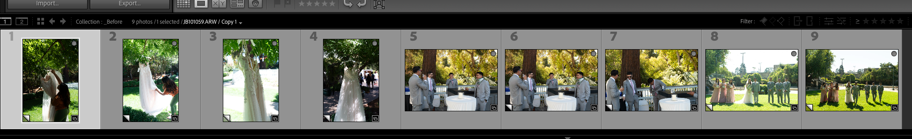

# Production Workflow System Design & Implementation: Baseline Conditioning and Rollback Pipeline

Part of the **Creative Workflow Batch Transformation Pipeline** umbrella project.

## Executive Summary

Large photo sets captured across changing lighting conditions often feel
visually inconsistent even when subject matter remains similar. This
stage defines a [normalization](#normalization) workflow that combines local corrective
cleanup, dataset-wide luminance normalization, scene-level color
normalization, post-cull Virtual Copy lineage, and rollback-safe
branching so the final gallery reads as coherent rather than ad hoc. Just as importantly,
it reduces operator-driven edit drift when the editor is repeatedly trying to match a chosen look across many
similar images. Virtual copies provide independent edit timelines for
experimentation without sacrificing rollback safety. The business value
is reduced editing time, lower operator comparison burden, more
consistent outputs across a heterogeneous dataset, and safer
exploration of alternate edit directions.

Within the larger pipeline, Stage 2 wraps deterministic conditioning
around heterogeneous creative input data. The source images remain
visually variable because lighting, scene composition, camera position,
and capture settings change over time; this stage reduces that variance
without flattening legitimate scene differences.

## Problem

High-volume photo datasets captured over long time horizons often
contain significant lighting variance across [scenes](#scene). Even
when the subject matter remains similar, changing sunlight conditions
alter how the camera sensor captures both brightness and color
information.

These lighting differences change the [visual tone](#visual-tone) of an
image, causing otherwise related photos to feel visually inconsistent.
Without a stable baseline, later adjustments interact differently with
each image, leading to visual divergence. In addition, that technical instability
produces a second-order effect: repeated manual attempts to match a preferred gallery
look can introduce operator-driven drift across the dataset, especially
when rollback to an earlier edit state is weak or costly.

The systems challenge is not to remove all visual difference. It is to
create a controlled operating range where downstream edits behave more
predictably while preserving authentic scene-level variation.

## Solution Overview

Within stage 2, the first Virtual Copy branch is created immediately
after RAW culling so the workflow has a protected source state before
cleanup or normalization begins. The three internal operations then
operate on that lineage-aware working set. First, batch-safe local
corrective cleanup removes validated capture artifacts before
normalization. In this implementation, dust/distraction removal was the
safer batch cleanup example, while Auto Transform straightening provided
a reviewed per-image corrective example with visible pass/fail outcomes.
Second, dataset-wide luminance normalization and scene-level color
normalization reduce unwanted variance while preserving natural
across-scene differences. Third, virtual-copy rollback control protects
the normalized baseline while still allowing experimentation. Across
those operations, the workflow reduces both technical variance and the
risk of operator-driven drift.

## Key Constraints

- [RAW](#RAW) capture preserves useful signal but increases dataset variance
- large datasets make continuous cross-image comparison cognitively expensive
- normalization must preserve natural scene variation rather than erase it
- later transformations perform better when input ranges are comparable

## Evidence Framing

This stage includes operational notes from the source photoshoot used to
develop and validate the workflow. These notes are not presented as
formal benchmarks; they are lived workflow observations that explain why
specific design choices exist and where the pipeline reduced real
editing friction.

Operational notes are labeled consistently so the document distinguishes
between general system design, domain background, and experience-derived
design rationale.

Each note follows the same basic structure:

- **Source context:** the relevant condition from the photoshoot or editing session
- **Observed constraint:** the specific friction, variance, or failure mode encountered
- **Design implication:** how that observation influenced the pipeline design or operation order
- **Workflow value:** why the resulting choice improved recovery, consistency, or review efficiency

## Stage 2 Pipeline Value - In Depth

Stage 2 creates value through an initial lineage setup followed by three
related operations. Each part reduces a different class of workflow risk,
and the combined effect is larger than the sum of the individual batch
effects.

### Lineage Setup Value: Protected Working State

The first Virtual Copy branch occurs immediately after RAW culling, before
Operation 1 or Operation 2. This creates a protected working state for
the culled image set so cleanup and normalization do not have to operate
directly on the original RAW selection.

This is not a fourth operation; it is the lineage setup that makes the
later operations safer. Operations 1 and 2 can transform the working
branch, while the original culled state remains available as the
earliest rollback point.

### Operation 1 Value: Cleaner Inputs

Operation 1 covers batch-safe local corrective cleanup. In this case
study, the validated cleanup operations were dust/distraction removal
and Auto Transform straightening. Dust removal is the safer batch
operation: if no dust is present, little or no change is applied. Auto
Transform is still useful because it evaluates each image independently,
but it requires stricter review because failed straightening must be
corrected later.

The value is not only cosmetic. Cleaner inputs reduce downstream review
noise and make later normalization easier to evaluate because the editor
is comparing global image state (image-to-image coherence) rather than
repeatedly noticing the same local defect.

### Operation 2 Value: Comparable Visual Baselines

Operation 2 establishes a dataset-wide luminance baseline and
scene-level color baselines. Luminance normalization aligns exposure and
tonal distribution across the full [dataset](#dataset), while color
normalization operates at the [scene](#scene) level so legitimate
environmental hue differences are preserved.

Without this distinction, later look adjustments can either behave
inconsistently because luminance distributions vary, or overcorrect
color by forcing naturally different scenes into one shared hue target.
The goal is therefore not a single global color match, but a stable
visual baseline that preserves real scene-level foliage and ambient
color differences.

### Operation 3 Value: Recoverable Edit Branches

Operation 3 protects the normalized baseline by using additional Virtual
Copy branches for experimentation. This changes rollback from a costly
return to raw source state into a controlled return to a known-good
baseline.

That matters because visual drift is often discovered late, after a
sequence of small adjustments has already spread across similar images.
Rollbackable branches make it safer to compare alternate creative
directions without losing the cleanup and normalization work that should
remain stable.

### Cross-Operation Logic

The operations are ordered linearly, but their impact is not purely
linear. Weakness in one operation can amplify downstream risk, while a
strong earlier operation can reduce the complexity of later decisions.

- **Operation 1 → Operation 2:** Cleaner inputs make luminance and scene-level color normalization easier to judge because visible defects are not competing with exposure, tone, or color evaluation.
- **Lineage setup → Operation 1:** The initial post-cull Virtual Copy branch gives cleanup a protected working state rather than forcing edits directly onto the original RAW selection.
- **Operation 2 → Operation 3:** A stronger visual baseline makes later Virtual Copy branches more meaningful because each branch starts from a comparable state rather than from unstable per-image variance.
- **Operation 3 → Operations 1 and 2:** Rollback-safe branching protects the value created by cleanup and normalization, preventing later creative experiments from destroying the stable baseline.
- **System-level effect:** The pipeline reduces repeated manual comparison loops by separating defect cleanup, visual baseline conditioning, and experimental edit branching into distinct control points.

## Pipeline Diagrams

The following simplified diagrams illustrate the three internal operations that make up this stage. Each operation progressively reduces variance while preserving scene-level differences.

### Operation 1 — Local Corrective Cleanup

```text
RAW Images (dataset)
      ↓
Culled RAW Selection
      ↓
Initial Virtual Copy Working Branch
      ↓
Fault-Tolerant Local Cleanup
(validated dust/distraction removal + reviewed Auto Transform)
      ↓
Cleaned Baseline Inputs
```
---

### Operation 2 — Global Luminance and Scene-Level Color Normalization

```text
Cleaned Baseline Inputs
      ↓
Global Luminance Normalization
(dataset-wide tonal analysis)
      ↓
Scene-Level Color Normalization
(per-scene hue and color-balance adjustment)
      ↓
Normalized Baseline Images
(reduced luminance variance and stabilized scene-level color)
      ↓

```
---

### Operation 3 — Virtual Copies and Rollback Control

```text
Normalized Baseline Images
      ↓
Additional Virtual Copy Branches Created
      ↓
Alternate Edit Direction A / B
      ↓
Compare, Keep, or Revert
```

The initial Virtual Copy branch is created after RAW culling to protect
the source selection before cleanup and normalization. Operation 3 then
uses additional branches to preserve the normalized baseline while making
alternate looks recoverable instead of destructive.

---

## Terminology

To clarify domain-specific language used throughout this document, the following system concepts are defined:

### Dataset & Structural Concepts

<a id="dataset"></a>
#### Dataset

A complete collection of images from a single photoshoot or capture session.

<a id="scene"></a>
#### Scene

A distinct composition within the dataset defined by a particular
foreground, subject, and background configuration. A single dataset
typically contains multiple scenes.

<a id="RAW"></a>
#### RAW

An uncompressed or minimally processed image format that preserves the
camera sensor's original luminance and color information for flexible
downstream editing. In this workflow, RAW capture retains more
recoverable signal than JPEG, but also increases variance that must
later be normalized.

### Perceptual Characteristics

<a id="visual-tone"></a>
#### Visual Tone

The combined luminance, contrast, and color characteristics of an image
that determine its perceived brightness, warmth/coolness, and overall
visual consistency.

### Luminance Transformation Primitives

<a id="exposure"></a>
#### Exposure

A global adjustment controlling overall image brightness by shifting the
luminance distribution uniformly across all pixels.

<a id="contrast"></a>
#### Contrast

A global adjustment controlling the separation between light and dark
regions in an image, increasing or decreasing the intensity difference
across the luminance distribution.

<a id="highlights-whites"></a>
#### Highlights / Whites

Upper-range luminance regions of an image. *Highlights* refer to
near-bright regions with recoverable detail, while *whites* represent
the brightest values approaching clipping. Adjustments to these regions
control brightness and detail retention in the upper portion of the
luminance distribution.

<a id="shadows-blacks"></a>
#### Shadows / Blacks

Lower-range luminance regions of an image. *Shadows* refer to darker
regions with recoverable detail, while *blacks* represent the darkest
values approaching clipping. Adjustments to these regions control detail
visibility and depth in the lower portion of the luminance distribution.

<a id="clipping"></a>
#### Clipping

Loss of recoverable image detail in highlights or shadows due to sensor
saturation or underexposure, where pixel values are driven to their
minimum or maximum limits and no additional tonal information can be
retrieved.

<a id="dynamic-range"></a>
#### Dynamic Range

The span between the darkest and brightest image regions that still
retain recoverable detail. In practical terms, it describes how much
shadow and highlight information can be captured or preserved before
those regions collapse into clipped blacks or blown highlights.

### Pipeline Concepts

<a id="normalization"></a>
#### Normalization

A batch conditioning operation that reduces unwanted variance across
images by bringing luminance and color distributions into a comparable
operating range. In this workflow, normalization is adaptive rather than
absolute: each image may receive different runtime adjustments based on
its own exposure, tonal distribution, and color balance. Luminance
normalization can be evaluated dataset-wide, while hue and color
normalization must respect scene boundaries.

<a id="reference-image"></a>
#### Reference Image

A representative image selected from a comparable scene group and used
as the visual target for normalization decisions. In Operation 2,
reference images help evaluate foliage hue, skin tone, or luminance
expectations without forcing unrelated scenes into the same target look.
A reference image is scoped to the scene or normalization concern it
represents; it is not a global target for the entire dataset.

<a id="automated-tonal-color-analysis"></a>
#### Automated Tonal and Color Analysis

A normalization operation that analyzes image luminance and color
distribution, then applies coordinated adjustments to exposure,
highlights/whites, shadows/blacks, contrast, color temperature, and tint
in order to reduce unwanted visual variance prior to downstream
transformations. Tonal analysis is used to establish a dataset-wide
luminance baseline; color analysis is constrained to scene-level
comparisons so natural environmental hue differences are not flattened.

<a id="virtual-copy"></a>
#### Virtual Copy

A non-destructive derived state that preserves an independent edit
timeline while continuing to reference the same underlying source image.

## Domain Background: RAW Capture and Signal Variance

Digital cameras typically offer two capture formats: **JPEG** and **RAW**. JPEG images are processed in‑camera using built‑in normalization, color profiles, and compression. While this produces visually pleasing images immediately, it also locks in tonal decisions made by the camera firmware and reduces the flexibility of downstream editing.

In contrast, **RAW images preserve the camera sensor's unnormalized luminance and color distribution**. This retains the full [dynamic range](#dynamic-range) of the captured signal and defers tonal interpretation to the post‑processing pipeline.

RAW capture therefore increases [dataset](#dataset) variance but enables **controlled, user‑defined normalization during post‑processing**, which motivates the normalization operation described in this stage.

Shooting in RAW is a deliberate decision because it preserves recoverable signal that would otherwise be lost in JPEG. RAW files retain significantly more highlight and shadow information from the sensor, allowing the editor to recover details from images that might initially appear unusable. For example, a frame with blown highlights or deep shadows can often be salvaged by recovering clipped highlight detail or lifting shadow information. In contrast, JPEG compression discards much of this recoverable signal and locks the image into a specific tone curve and color profile, making such recovery far more limited.

> **Operational note:** In the source photoshoot, RAW capture was
> especially important in low-light venue conditions where heavy tree
> cover reduced available light and made detail recovery more difficult.
> In that environment, RAW preserved the best chance of recovering usable
> image quality during post-processing.

This background context explains why RAW datasets exhibit higher variance and why a normalization stage becomes necessary before consistent batch edits can be applied.

### What Normalization Means Here

In this pipeline, [normalization](#normalization) means reducing unwanted
visual variance across a dataset while preserving meaningful scene
differences. It does not mean forcing every image to the same exposure,
white balance, or color profile.

Instead, normalization establishes a comparable baseline operating range
for downstream edits. Each image can receive different runtime
adjustments because each image starts with different luminance, contrast,
and color conditions. The batch operation is shared, but the effective
transformation is image-specific.

Color normalization is also scene-specific. A yellow-green foliage scene
should not be forced to match a deeper green scene if that hue
difference reflects real lighting, location, or environmental context.
The Operation 2 examples later in this document show this distinction
using foliage and skin tone normalization. In this workflow, luminance
can be normalized across the broader dataset, but hue and color-balance
decisions are evaluated within scene groups.

This distinction matters because the goal is not visual flattening. The
goal is to make later edits behave more predictably by reducing
unwanted input variance before creative decisions, semantic masking, or
manual refinement are applied.

### Conceptual RGB Divergence Example

A useful way to explain baseline conditioning is to compare how the same
manual edit behaves against two different starting states. If one image
has been baseline conditioned and another has not, the same creative
adjustment can push their sampled color values farther apart rather than
closer together.

This can be shown with representative RGB samples, either from a global
luminance region or from a scene-specific hue region such as foliage or
skin tone:

```text
Target look sample:
  RGB(92, 118, 64)

Image A - not baseline conditioned:
  before manual edit: RGB(62, 91, 48)
  after edit:    RGB(83, 132, 58)
  result: closer in brightness, but hue shifts away from target

Image B - baseline conditioned first:
  before manual edit: RGB(79, 109, 59)
  after same edit:    RGB(91, 119, 65)
  result: converges toward the chosen look with less drift
```

TO DO: The exact RGB values should be replaced with sampled values from the
embedded photos when the visual evidence is finalized. The conceptual
point is that baseline conditioning reduces input variance before the
manual edit is applied, so the same edit is less likely to amplify
divergence from the chosen unified look.

---

## Detailed Problem Context

Large photo sets captured across multiple lighting environments introduce
high variance in [visual attributes](#visual-tone). The pipeline must handle diverse
conditions and scale across the dataset without introducing inconsistency.

Example capture conditions include:

- midday direct sunlight
- shaded environments
- late-afternoon or evening lighting

These conditions introduce variance in:

- exposure
- contrast
- color temperature
- foliage and environmental tones
- skin tone rendering

A naive global editing strategy (e.g., applying identical exposure
adjustments across all images) yields inconsistent results. The same
parameter change interacts differently with each scene.

That technical instability creates a second-order workflow effect: the
editor must repeatedly rematch a chosen look across related images in
order to keep the gallery coherent.

> **Operational note:** This became especially visible in group formals.
> Although those images were already highly similar, repeated manual
> rematching still introduced edit-direction drift once the workflow
> lacked a stable shared baseline.

> **Operational note:** Rollback was technically available, but it was
> still costly because reverting often meant returning to raw source
> state rather than to a reusable intermediate baseline shared across
> similar group portraits. In other words, recovery existed, but the
> rollback target was too primitive to preserve the normalization work
> that should have remained stable.

The workflow goals are:

- establish a consistent luminance baseline across the dataset
- establish scene-level color baselines without flattening natural hue differences
- preserve natural [scene](#scene) differences (e.g., time-of-day mood)
- minimize manual editing effort
- avoid repeated global transformations across the editing pipeline

Importantly, the pipeline does **not** eliminate all variation between images. Lighting differences across [scenes](#scene) (e.g., midday sun vs shaded evening light) still produce natural mood differences. The internal operations in this stage instead constrain variance to a controlled range, ensuring that images remain visually related while still preserving authentic [scene](#scene) characteristics such as time-of-day lighting and environmental context.

> **Operational note:** The strongest demonstration of scene-level color
> normalization is the wedding-dress foliage scene, where several frames
> share a comparable environment but still need per-scene hue alignment.
> The group formal portraits are a stronger candidate for luminance
> normalization because the green hue is relatively stable across those
> frames. The yellow-green foliage scene is the weakest candidate for
> color normalization because changing its hue to match the other scenes
> would erase a natural across-scene difference.

## Initial, Naive Approach (Multi-Stage Global Develop Presets)

The original Stage 2 workflow attempted multiple visual Develop preset
layers across the dataset:

```text
Import preset
→ secondary editing preset
→ additional correction preset
```

These are image-adjustment presets, not the Stage 1 metadata presets
used for authorship and semantic enrichment. Stage 1 intentionally uses
non-overlapping metadata preset layers; the problem here is different:
multiple broad visual adjustment presets were stacked across the same
image set without a stable conditioned baseline.

This introduced several issues:

- repeated global edits across the dataset
- increased pipeline complexity
- difficulty maintaining a consistent baseline
- additional manual intervention per image

The pipeline effectively introduced multiple global transformation stages,
increasing the risk of inconsistent results.

---

## Technical Design & Implementation

Within the larger creative workflow pipeline, Stage 2 collapses multiple
global edit passes into one deterministic baseline-conditioning sequence:
local corrective cleanup, dataset-wide luminance normalization,
scene-level color normalization, and Virtual Copy lineage protecting both
the initial culled selection and later normalized baselines.

### Stage 2 Operation Flow

```text
RAW Images (dataset)
      ↓
Culled RAW Selection
      ↓
Initial Virtual Copy Working Branch
      ↓
Operation 1: Local corrective cleanup
(validated dust/distraction removal + reviewed Auto Transform)
      ↓
Operation 2: Global luminance and scene-level color normalization
(dataset-wide tonal analysis + per-scene color adjustment)
      ↓
Operation 3: Additional virtual-copy branching and rollback control
(preserve baseline while exploring alternate edit directions)
      ↓
Consistent dataset baseline with preserved scene variation
```

### Operation 1: Local Corrective Cleanup

Operation 1 covers batch-safe local corrective cleanup before any
dataset-wide normalization is applied. In this workflow, the validated
cleanup operations were dust/distraction removal and Auto Transform
straightening.

#### Dust / Distraction Removal

The source images in this example show visible dust from either the
camera body sensor or lens, lowering image quality. The Dust Distraction
Removal feature is applied to one representative image in Lightroom's
Develop module, then synchronized across the selected images.

Because the operation is fault-tolerant, it can be applied across the
selected dataset with review, while images without visible dust are left
largely unchanged. This enables efficient batch cleanup before the later
normalization and downstream editing passes.

Because this kind of correction is local and repeated, it is a good
candidate for early batch handling. It reduces visible dust artifacts up
front so later baseline normalization is working from cleaner inputs
rather than repeatedly compensating around the same artifacts.

#### Auto Transform Straightening

Auto Transform straightening is also useful in Operation 1 because it
evaluates each image independently rather than applying one fixed
rotation value across the batch. In the recorded evidence, the automated
straightening pass worked reliably on four unrelated photos and failed
on one; the review set marked passes in green and the failure in red.

This makes Auto Transform less batch-safe than dust removal. Dust removal
is largely no-op when no visible dust is present, while a failed
straightening result creates work that must be corrected later. For that
reason, Auto Transform belongs in Operation 1 as a reviewed corrective
cleanup candidate, not as an indiscriminate batch operation.

**Outcome:**
- cleaner baseline inputs before dataset-wide normalization
- reduced need to repeatedly correct the same local defect or alignment issue later
- explicit review surface for automated straightening failures
- lower operator burden during downstream review

---
🚧 TODO — EVIDENCE
Type: Workflow
Asset: operation1_cleanup_examples
Purpose: Show dust/distraction cleanup and Auto Transform straightening as Operation 1 examples, including the green/red pass-fail review for Auto Transform.
---

### Operation 2: Global Luminance and Scene-Level Color Normalization

The second operation uses automated tonal analysis to normalize
luminance across the dataset, then applies color normalization within
scene boundaries. This reduces unwanted visual variance while preserving
legitimate environmental hue differences between scenes.

This stage adjusts:

- [exposure](#exposure)
- [contrast](#contrast)
- [highlights / whites](#highlights-whites)
- [shadows / blacks](#shadows-blacks)
- scene-level color temperature
- scene-level color tint and hue balance

This is conceptually similar to feature scaling and histogram
normalization in data pipelines. The goal is not perfect grading per
image but a reduced variance baseline for downstream processing.

This is also analogous to tabular-data normalization in that it reduces
variance before downstream processing. The difference is that the
normalization target here is perceptual image state rather than numeric
feature columns.


This stage reduces large luminance variance across the dataset and
unwanted color variance within scene groups so that downstream
corrections behave predictably. Without this normalization operation,
later adjustments interact inconsistently with each image because their
underlying exposure, tonal, and scene-level color distributions differ.
As a result, the editor is more likely to compensate manually on a
per-image basis, which increases the chance of gallery drift when trying
to maintain a consistent look.

In practice, editors attempting to correct this manually are forced into
a continuous cycle of per-image adjustments and cross-image comparison.
They must repeatedly zoom into individual images to fine-tune exposure,
tonal values, and color balance, then zoom out to evaluate consistency
across the broader dataset. This constant context switching introduces
cognitive fatigue and increases the likelihood of drift from both
scene-level and gallery-level consistency. Once a poor sequence of
adjustments has been applied across multiple images, weak rollbackability
makes recovery even harder.

By establishing a consistent dataset-wide luminance baseline upfront, the
pipeline removes much of this instability. By constraining color
normalization to scene groups, it also reduces repeated temperature,
tint, and hue rematching across similar images without flattening
legitimate across-scene differences. Subsequent adjustments operate on
comparable visual distributions, enabling downstream look corrections to
produce stable, repeatable results without continuous manual
recalibration.

#### Foliage Hue Normalization

Foliage is a useful Operation 2 example because it exposes the
difference between legitimate scene variance and unwanted within-scene
drift. A true global hue target would be too aggressive: yellow-green
foliage in one scene should not be forced to match deeper green foliage
from a different lighting environment.

The strongest [reference image](#reference-image) candidate for
demonstrating scene-level foliage normalization is the wedding-dress
foliage scene because the subject and environment are similar enough to
compare hue drift within the scene. The group formal portraits are a
stronger candidate for luminance normalization because the green hue is
relatively stable, while the yellow-green foliage scene is the weakest
candidate for color normalization because its hue difference appears
scene-authentic.

```text
Without scene boundaries:
  repeated manual compensation
  → cross-scene hue flattening
  → edit-state drift and weak reversibility

With scene-level foliage normalization:
  comparable scene group selected
  → hue drift reduced within the scene
  → natural across-scene foliage variance preserved
```



*This comparison shows why foliage hue normalization must be constrained
to comparable scene groups. The wedding-dress foliage scene is the
strongest candidate for demonstrating scene-level hue alignment because
its frames share a similar subject/environment relationship while still
showing within-scene foliage drift. The group formal portraits are a
better luminance-normalization candidate because their green hue is
already relatively stable. The yellow-green foliage scene should remain
visually distinct rather than being forced to match the deeper green
foliage from the other sampled scenes.*


#### Skin Tone Normalization

Skin tone is a separate Operation 2 concern because it is evaluated
against subject consistency rather than environmental consistency. A
scene can preserve natural foliage or ambient color while still needing
skin tones to remain believable and consistent across similar portraits.

In practice, skin tone normalization should be evaluated against a
[reference image](#reference-image) within comparable portrait groups
after the luminance baseline is established. This prevents exposure
differences, mixed shade, or local color casts from causing manual
overcorrection while still avoiding a single global skin-tone target
across unlike scenes.

```text
Dataset-wide luminance baseline
      ↓
Comparable portrait group selected
      ↓
Skin tone checked for believable within-group consistency
      ↓
Residual color correction applied only where needed
```

---
🚧 TODO — EVIDENCE
Type: Visual
Asset: skin_tone_scene_level_normalization
Purpose: Show skin tone consistency within comparable portrait groups after luminance normalization.
---

**Outcome:**
- reduced luminance variance across the dataset
- reduced hue/color variance within scene groups
- predictable downstream transformations
- significant reduction in repeated per-image exposure and scene-level color correction (residual adjustments may still be required in edge cases)

### Operation 3: Virtual Copies and Rollback Control

Virtual Copies enter the workflow before Operation 1: after RAW culling,
the selected images are branched into an initial working state so cleanup
and normalization do not overwrite the original culled selection. After
Operation 2 establishes a stable luminance and scene-color baseline,
Operation 3 uses additional Virtual Copy branches to protect that
baseline from operator-induced drift.

Virtual Copies provide a lightweight lineage mechanism for alternate edit
paths: instead of overwriting a single edit history, the workflow can
branch an image into parallel adjustment timelines while keeping the same
underlying source asset.

In this workflow, that matters because a bad sequence of global or
domain-level adjustments can otherwise propagate across many similar
images before the editor realizes the gallery has drifted away from the
intended look.

**Outcome:**

- **Rollbackable experimentation:** Alternate edit directions can be
  tested without destroying the normalized baseline.
- **Comparative review:** Competing edit directions can be compared
  without forcing every experiment into one mutable history.
- **Source protection:** The first post-cull Virtual Copy keeps the
  original culled RAW selection available before cleanup and
  normalization.
- **Baseline preservation:** Once a chosen direction begins to drift,
  the editor can revert to a known-good state instead of manually
  untangling accumulated edits.

**Engineering Analogy:**
This operation behaves like lightweight branch management over a shared
source record. Virtual Copies behave like non-destructive derived states:
multiple transformation histories can reference the same source record
while preserving separate downstream edit decisions.

---


## System Constraints & Scale Considerations

The current implementation is designed as a **local, editor-in-the-loop batch pipeline** operating within Lightroom Desktop / Classic rather than as a cloud-native or distributed image-processing system. RAW files, virtual copies, and downstream edits are managed within a local catalog-centered workflow optimized for a single operator performing interactive review and refinement.

This design favors **editing throughput, controllability, and local responsiveness** over distributed scalability. Operations 1 and 2 are primarily preprocessing operations that establish a normalized baseline, while Operation 3 preserves that baseline during experimentation and revision.

In practical terms, the pipeline is intended to scale across **hundreds of RAW images per dataset**, not to serve as a real-time or horizontally distributed processing system. The relevant engineering question is therefore not formal algorithmic complexity in the abstract, but rather **observed operational latency, throughput, and reduction in manual intervention** as dataset size increases.

If stronger quantitative support is needed later, future validation can
benchmark representative datasets of different sizes and record per-stage
processing time, downstream manual correction time, and total editing
time. For now, the primary evidence model for this stage is visual
and workflow-observable rather than heavily instrumented.


---
🚧 TODO — EVIDENCE
Type: Workflow
Asset: pipeline_stage_views
Purpose: Show the Lightroom collection structure for Stage 2, including post-cull Virtual Copy lineage, Operation 1 cleanup, Operation 2 normalization, and Operation 3 rollback branches.
---

## Failure Modes & Edge Cases

Although the pipeline reduces variance and improves editing consistency, each stage still has failure modes that require manual judgment or override.

### Operation 1 Failure Modes

Local corrective cleanup can still fail when dust artifacts are missed,
over-corrected, or applied too broadly. Fault-tolerant cleanup is helpful
for repeated artifacts such as dust, but the result still requires
selective operator review. Auto Transform can also fail when Lightroom's
geometry inference chooses an incorrect horizon or alignment target; in
that case, the result must be flagged and corrected manually.


---
🚧 TODO — EVIDENCE
Type: Workflow
Asset: cleanup_failure_cases
Purpose: Show Operation 1 review cases where dust cleanup or Auto Transform straightening required manual review, including the known Auto Transform failure case.
---

### Operation 2 Failure Modes

Global luminance normalization and scene-level color normalization can still produce imperfect results when scenes contain **extreme [dynamic range](#dynamic-range)**, strong backlighting, heavy [clipping](#clipping), mixed color temperatures, or intentionally stylized lighting conditions. For example, a deliberately composed **silhouette image**—such as a wedding couple rendered primarily as shadow shapes with little or no recoverable facial or subject detail—may be interpreted by Lightroom’s automated tonal analysis as unintentionally underexposed and therefore brightened, even when the low-key silhouette treatment was the **intended creative choice**. Color normalization can also fail if dissimilar scenes are grouped together and natural foliage hue differences are treated as errors. In these cases, automated analysis may reduce variance without fully establishing a sufficient baseline, and residual per-image exposure or scene-level color correction may still be required.


---
🚧 TODO — EVIDENCE
Type: Visual
Asset: stage2_failure_cases
Purpose: Show Operation 2 failure modes such as extreme dynamic range, silhouette images, mixed color temperature, or incorrect scene grouping for color normalization.
---

### Operation 3 Failure Modes

Virtual-copy branching can still fail when branch discipline is weak. If
the initial post-cull branch, normalized baseline branch, and later
experimental branches are not clearly named, compared, or pruned, the
editor can lose track of which branch represents the intended baseline
versus an experimental detour. In that case, branching reduces recovery
cost in theory but not in practice.


---
🚧 TODO — EVIDENCE
Type: Workflow
Asset: virtual_copy_failure_cases
Purpose: Show how weak branch naming, comparison, or pruning can make Virtual Copy rollback harder to use in practice.
---

### System-Level Failure Modes

At the system level, failure can also occur when too many manual
overrides are required. Excessive exception handling reduces the
throughput benefit of the pipeline and can reintroduce the same
cross-image comparison burden that the workflow is intended to remove.
In practice, weak Operation 1 cleanup, a weak Operation 2 baseline, or
weak Operation 3 rollback discipline can each
increase downstream instability and reduce overall consistency.


---
🚧 TODO — EVIDENCE
Type: Visual
Asset: pipeline_instability_example
Purpose: Show how weak cleanup, weak normalization, or weak rollback discipline can compound into downstream gallery inconsistency.
---

## Observability & Validation

This implementation is primarily validated through **embedded visual
evidence**, **editor-observed workflow effects**, and clearly labeled
inference. Because parts of the workflow depend on Lightroom’s internal
heuristics, the most credible proof for this stage is observable
before/after behavior rather than heavy quantitative instrumentation.

### Optional Future Metrics

If stronger quantitative support is needed later, the most practical
measurements for this workflow would be:

- total editing time per dataset
- editing time per delivered image
- number of residual local defect or straightening corrections after Operation 1
- number of residual manual exposure or scene-level color corrections after Operation 2
- number of virtual-copy branches or reversions required after failed
  edit directions in Operation 3

These measurements would help quantify whether the pipeline reduces
manual intervention and improves throughput in practice, but they are
not required for the current visuals-first version of this implementation document.

### Operation 2 Validation

A lightweight validation approach is to show representative before/after
image subsets from the same [dataset](#dataset) and visually inspect
whether automated tonal analysis reduces dataset-wide luminance variance
and whether scene-level color normalization reduces unwanted hue drift
within comparable scene groups. If needed later, that visual comparison
could be supplemented with recorded pre- and post-adjustment values for
[exposure](#exposure), [contrast](#contrast), [highlights / whites](#highlights-whites),
[shadows / blacks](#shadows-blacks), color temperature, tint, and hue.


---
🚧 TODO — EVIDENCE
Type: Visual
Asset: stage2_sample_comparison
Purpose: Show representative before/after subsets for dataset-wide luminance normalization and scene-level color normalization.
---

### Operation 3 Validation

Operation 3 can be validated by testing alternate edit directions on
Virtual Copies and recording whether the editor can return to a known
good baseline without manual untangling. The central engineering
question is whether branching and rollback materially reduce edit-state
drift during look-matching.

Validation here should be primarily visual and workflow-observable. The
key question is whether the editor can compare alternate directions,
revert cleanly, and preserve gallery consistency without losing the
baseline or manually untangling accumulated edits.


---
🚧 TODO — EVIDENCE
Type: Workflow
Asset: virtual_copy_recovery_comparison
Purpose: Show alternate edit branches and demonstrate returning to a known-good normalized baseline without manually untangling edits.
---

### Baseline Comparison

> **Operational note:** A known baseline from the prior workflow is
> approximately **42 hours of edit time** to complete a 1500-image RAW
> gallery that was ultimately culled to 375 edited images. That
> historical workflow included repeated global corrections, inconsistent
> convergence, and extensive manual adjustment.

That baseline can remain contextual support without forcing a formal
before/after table into the document. If stronger quantitative evidence
is useful later, a retrospective comparison can be added, but the
current writeup does not depend on it.

## Design Tradeoffs

The pipeline improves consistency and throughput, but it does so through explicit tradeoffs rather than through full automation.

### Automation vs Editorial Control

Operations 1 and 2 automate high-frequency repetitive operations, while
Operation 3 remains intentionally editor-guided because branch
selection, comparison, and rollback still depend on editorial judgment.

This tradeoff is especially important when the editor is comparing
multiple plausible looks. A purely linear history makes it harder to
test alternatives safely; a branchable workflow preserves control
without forcing every experiment to overwrite the baseline.


---
🚧 TODO — EVIDENCE
Type: Workflow
Asset: client_preference_example
Purpose: Show how Virtual Copy branches support comparing alternate client-facing looks without overwriting the baseline.
---

### Consistency vs Authentic Scene Variation

The system is designed to reduce unwanted variance, not to eliminate all variance. Over-normalization would flatten meaningful differences between [scenes](#scene), especially when time-of-day lighting or environmental color legitimately changes the mood of an image.

### Upfront Cleanup and Normalization vs Downstream Speed

Operations 1 and 2 introduce upfront cleanup and normalization work, but
that cost is repaid through faster downstream editing. This is a
deliberate trade of early processing overhead for reduced repeated work
later in the pipeline.

In real editing workflows, the cost of skipping this baseline work is
not limited to cumulative time alone. When global cleanup and
normalization are not established early, the editor must repeatedly
re-correct near-identical images and re-compare them against the rest of
the gallery. That raises both cognitive load and the chance of
inconsistent edits.


---
🚧 TODO — EVIDENCE
Type: Visual
Asset: baseline_consistency_comparison
Purpose: Show the downstream consistency difference between images edited after baseline conditioning and images edited without a stable baseline.
---


### Rollback Safety vs Branch Sprawl

Operation 3 gains safety by making alternate directions recoverable, but
that also introduces the need for disciplined branch naming,
comparison, and pruning. Too many unmanaged branches can create their
own form of operator confusion.

### Local Workflow Efficiency vs Cloud-Native Scalability

The current implementation is optimized for a local Lightroom workflow controlled by a single editor. This makes it practical and immediately useful, but it also means the system is not designed for distributed execution, real-time serving, or cloud-native orchestration.

### Vendor Heuristics vs Full Transparency

The workflow benefits from Lightroom’s built-in automation, but some stages depend on vendor-controlled black-box heuristics. This improves usability and speed while limiting transparency into the exact internal logic of automated tonal analysis and scene-level color adjustment.

## Baseline Preservation Strategy

Virtual Copies preserve both the initial culled RAW state and later
known-good normalized baselines while allowing derived edit paths to
evolve independently. This trades a small amount of branch-management
overhead for much safer experimentation later.

This mirrors engineering patterns such as immutable baselines,
branchable derived states, and rollbackable experimentation.

---

## Controlled Manual Overrides

Manual per-image overrides remain available for edge cases but are
intentionally limited. Excessive local correction increases cognitive
load and reduces editing speed.

Design rationale:

- overly granular control increases cognitive load
- editing speed decreases with too many one-off overrides
- most images need minimal manual intervention after the baseline is established

The workflow prioritizes addressable control rather than complete control.

---

## Resulting Benefits

- consistent luminance baseline across heterogeneous input distributions
- scene-level color baselines that preserve natural hue differences
- reduced global editing passes
- safer experimentation through rollbackable edit branches
- reduced manual correction churn
- predictable editing pipeline mechanics
- preservation of natural scene tone and foliage hue differences

---

## Engineering Concepts Demonstrated

- baseline dataset normalization
- validated dust/distraction cleanup before baseline normalization
- reviewed Auto Transform straightening before baseline normalization
- dataset-wide luminance normalization
- scene-level hue and color normalization
- rollbackable experimentation over shared source assets
- pipeline stage simplification
- batch processing optimization
- virtual copies as lineage-preserving experimental branches
- rollbackable edit timelines over shared source assets
- controlled override systems
- cognitive complexity management

---

## Key Design Principle

Clean validated dust/distraction artifacts and review Auto Transform
straightening first, establish a dataset-wide luminance baseline and
scene-level color baselines second, then protect that baseline with
rollbackable Virtual Copy branches.

---

## Takeaway

This photography workflow becomes a data transformation pipeline design
problem. By separating local cleanup, dataset-wide luminance
normalization, scene-level color normalization, and rollbackable
experimentation into distinct operations, the system achieves dataset
consistency and editing efficiency without sacrificing image fidelity,
natural scene variance, or processing flexibility.
