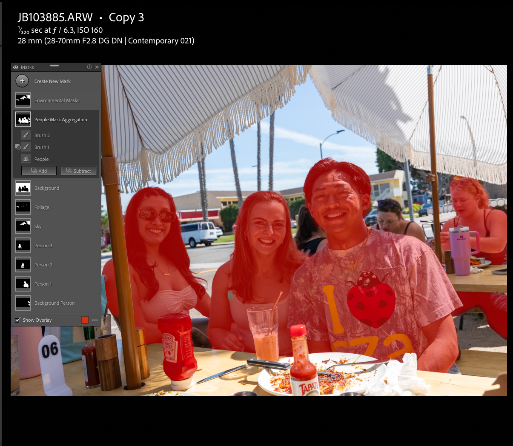
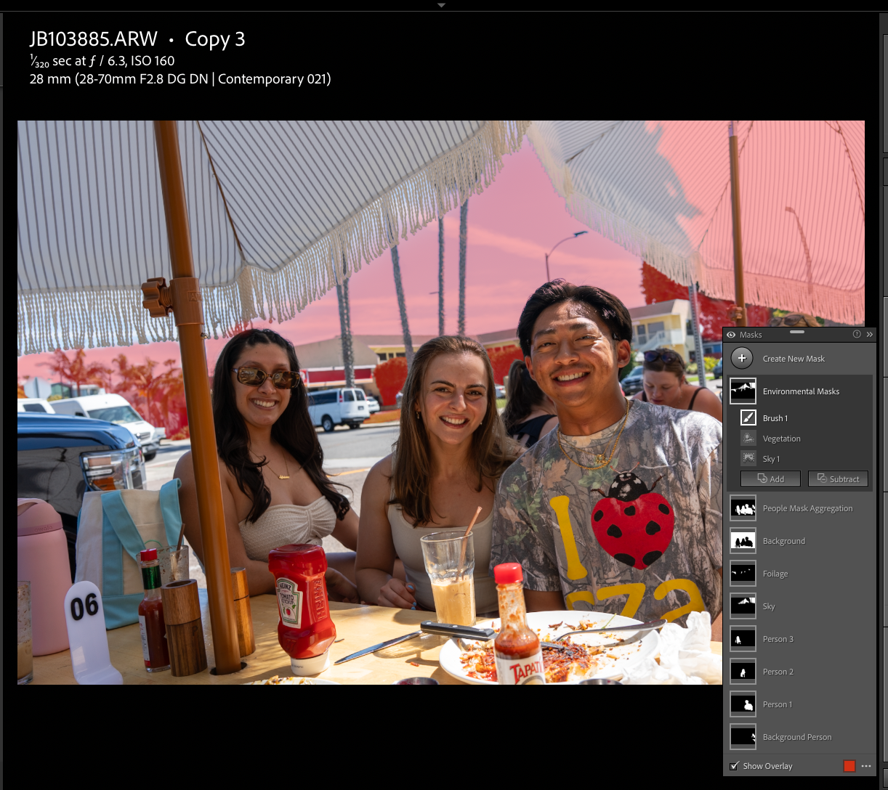

# Production Workflow System Design & Implementation: AI Mask Definition Propagation

Part of the **Creative Workflow Batch Transformation Pipeline** umbrella project.

## Executive Summary

This stage evaluates whether AI-generated semantic masks can be treated
as reusable batch artifacts rather than one-off, image-specific edits, similarly to Stage 2.
The workflow defines mask logic once on a [canonical image](../../docs/terminology.md#canonical-image),
then applies that logic across a full gallery to test whether Lightroom
recomputes the masks per image reliably enough for production-scale use.
The value is reduced repetitive masking effort while preserving a clear
boundary for operator review when semantic detection fails or degrades.

Within the larger pipeline, Stage 3 extends the deterministic workflow
pattern to probabilistic AI outputs. AI masks are not treated as
automatically correct; they are treated as candidate semantic operations
that must be qualified, propagated within defined boundaries, and
reviewed by a human operator.

## Problem

Manual semantic masking is expensive at gallery scale. When similar
adjustments are needed across hundreds of photos, manually brushing each
semantic region image by image becomes a throughput bottleneck. Without
a reusable mask-definition workflow, repeated local edits remain tied to
per-image manual execution.

Unlike Stage 2 normalization, which controls variance in the image data
itself, Stage 3 controls uncertainty introduced by AI model behavior:
semantic regions may be detected cleanly, omitted safely, partially
misbound, or produced with boundaries that require operator judgment.
The systems challenge is to propagate AI-generated mask definitions
safely across a heterogeneous dataset without copying brittle pixel
selections or introducing silent failures that would require extensive
rework.

## Solution Overview

The workflow selects a canonical image containing many relevant
semantic categories, defines the mask logic once on that image, and then
batch-pastes those definitions across the gallery. Lightroom recomputes
the masks per target image using dynamic semantic segmentation rather
than copying static mask pixels. This implementation scales that feature
from single-image editing into a batch workflow, then evaluates the
mechanism qualitatively by examining mask quality, omission behavior,
and operational usefulness relative to the alternative — manual masking.

## Key Constraints

- target images vary in subjects, scene composition, and detectable categories
- Lightroom's internal masking implementation logic is not directly observable
- some propagated masks may be omitted rather than generated on every image
- AI segmentation quality can degrade or improve in non-obvious,
  image-specific ways
- automation must remain compatible with later manual review and correction

## Technical Design & Implementation

### Core Concepts

- define mask logic once, then apply it across an entire dataset
- use AI segmentation to dynamically recompute masks per image for people, sky, vegetation, and other semantic regions
- keep mask operations fault-tolerant when target objects are missing
- qualify uncertain semantic regions before promoting them to full-batch
  propagation

> **Note:** Unlike a traditional software operation that often has a
> clear binary outcome, semantic mask propagation can partially succeed.
> A mask may bind to the correct region but with weak boundaries, omit a
> category that is not detectable, or produce a plausible result that
> still requires editorial judgment. Because the behavior depends on AI
> segmentation rather than fully observable deterministic rules, this
> stage treats human operator review and interpretability as a required
> part of the validation design, not an optional cleanup step. This is
> why the implementation below is structured as a qualification and
> review workflow rather than a one-time batch command.


### Experiment Objectives

1. **Confirm propagation behavior:** verify that Lightroom reuses mask definitions as procedural instructions and recomputes the target regions per image, rather than copying fixed pixel selections.
2. **Review operational mask quality:** inspect the generated masks to confirm that expected subjects and regions were detected, contained, and usable for downstream editing.

### Evaluation Criteria

- **Detection completeness:** whether expected semantic regions such as people, sky, and foliage are generated when present.
- **Omission behavior:** whether absent semantic regions are safely skipped rather than producing incorrect masks.
- **Semantic binding (classification):** whether each generated mask binds to the intended semantic class or region rather than a visually adjacent or incorrect class.
- **Boundary containment (mask edge quality):** whether generated mask boundaries stay contained within the intended subject regions rather than bleeding into adjacent areas.

The evaluation reduces to four operator checks:

```text
Expected region present   → mask generated?
Expected region absent    → mask skipped?
Generated mask            → correct semantic class?
Generated mask            → contained boundary?
```

Together, these criteria determine whether the propagated masks are
usable for downstream edits with bounded human review.

> **In-depth note:** Omission is not always negative. If a target image
> lacks the category, omission is the desired fault-tolerant behavior; it
> only becomes a failure when a needed region exists but is not detected.
> Misclassification is a separate failure mode from boundary bleed: the
> mask may have clean boundaries but still bind to the wrong semantic
> region, such as treating part of a person as pavement or another
> background surface.

### Canonical Image Selection Criteria

This follows a similar batch-enabling pattern to the Stage 2 reference
image, but the function and scope are different. A Stage 2 reference
image acts as a visual target for normalization within a comparable
scene group. A Stage 3 canonical image acts as a semantic source for
mask definition propagation across the broader dataset.

As established in Stage 2, exposure and scene conditions can vary across
otherwise related images due to camera setting changes, camera position,
or subject/environment placement. Stage 2 reduces that variation at the
baseline image level; Stage 3 provides a more granular local-control
layer for the same multi-variable variation by targeting semantic
regions independently. A strong canonical image should therefore contain
multiple regions that may need independent correction after mask
propagation.

- **Maximum number of in-focus subjects:** More detectable people create more reusable person-mask definitions for downstream edits. Overshooting people masks has little observable downside because Lightroom can omit unavailable masks on images where fewer subjects exist.
- **Clearly separated primary subjects:** Subjects should be visually distinct enough for Lightroom to bind masks to people rather than background regions or overlapping bodies.
- **Vegetation or foliage:** Stage 2 already establishes scene-level foliage hue normalization. In Stage 3, vegetation masks provide optional semantic-region control for further batch adjustment or manual single-image refinement when the Stage 2 baseline is insufficient.
- **Sky:** Sky is a high-value semantic edit target because brightness and tonal changes are often visually obvious in sky regions and thus require editing.
- **Background aggregate:** A background mask supports aggregate region control when the entire backline needs exposure or tonal adjustment, even if constituent regions such as sky, foliage, and artificial ground are also masked independently. This matters when background areas are underexposed while near-lens subjects are overexposed.
- **Foreground subject aggregate:** Group-level people masks provide a matching control layer for the frontline: adjusting all human subjects together instead of correcting each person one at a time.
- **Representative scene complexity:** The image should contain enough people and environment variety to generate useful masks, but not be so cluttered that mask boundaries are unusually ambiguous.
- **Usable focus and exposure:** The semantic regions should be sharp and readable enough that mask quality failures are likely to reflect propagation behavior rather than poor source-image quality.

> **Selection note:** The goal is not simply to choose a visually strong
> photo; it is to choose a source image that can be sliced into as many
> useful, sufficiently accurate mask definitions as possible. Strong
> candidates support both semantic-region control, such as people, sky,
> foliage, and ground, and plane-wise control, such as foreground subject
> groups and background environmental areas. More masks are useful only
> when their detection quality is high enough to remain editable after
> propagation.

The selection strategy intentionally favors a rich source image. If a
mask category is absent from a target image, Lightroom can omit that mask
rather than applying an incorrect static region. This makes a mask-rich
canonical image useful for maximizing the set of reusable mask
definitions available for downstream corrections across the dataset.


### Canonical Image Selection
From a [culled gallery](../../docs/terminology.md#culling), a single [canonical image](../../docs/terminology.md#canonical-image) was
selected using the criteria defined above. Because Stage 3 operates
after the post-ingest culling boundary, the candidate image set has
already been narrowed to photos with sufficient focus, aesthetic
distinctiveness, subject relevance, and downstream edit potential.

### Semantic Region Qualification Experiment

Uncertain semantic regions should be qualified before they are promoted
to full-batch propagation. A canonical image can be strong for people,
sky, and foliage while still being a weak source for a specific region
such as artificial ground if that region has limited visible signal or
ambiguous boundaries.

This experiment will compare multiple source-definition strategies for
artificial ground before applying any candidate definition across the
full dataset:

- artificial ground generated from the current canonical image
- artificial ground generated from an alternate image with stronger ground signal
- artificial ground created or refined manually, if manual definition produces a cleaner reusable boundary

Each candidate definition should first be applied to a representative
subset of target images, then evaluated for detection and omission
behavior, semantic binding correctness, and boundary containment. Only
qualified definitions should be promoted to full-batch propagation.

```text
Define uncertain semantic region
      ↓
Apply to representative subset
      ↓
Review detection, binding, and boundary containment
      ↓
Promote, revise, or reject definition
      ↓
Full-batch propagation only if qualified
```

---
🚧 TODO — EVIDENCE
Type: Workflow
Asset: artificial_ground_semantic_region_qualification
Purpose: Compare artificial-ground mask definitions from multiple source images and/or manual refinement before promoting a qualified definition to full-batch propagation.
---


## Evidence/Example Application of Mask Propagation (w/ Images)

### Mask Definition Phase
On the canonical image, masks were created manually for each detected category.

The canonical image generated 7 total masks, representing different semantic regions within the scene.

These masks serve as the procedural mask definitions used for the batch experiment.

Importantly, Lightroom stores these masks as instructions describing how to detect and adjust regions, rather than static pixel selections.


### Batch Mask Application
Only the mask definitions from the canonical image were copied. The
Stage 2 tonal and hue adjustments were already complete and were not
part of this paste operation.

These mask definitions were then pasted across all images in the gallery, without regard to whether the same semantic categories existed in each image.

Examples of variation within the dataset include:

- images containing fewer people than the canonical image
- images containing sky but no foliage
- images containing foliage but no sky
- images containing entirely different individuals

No per-image adjustments were made prior to the batch paste operation.

### Expected Computational Workload
The canonical image produced: 7 masks

Applied across: 64 images

This yields a theoretical maximum of: 7 × 64 = 448 mask-definition executions

Aggregate masks are tracked separately from individual semantic masks
because they represent broader foreground or background control surfaces.
The final workload count should be updated after the aggregate-mask and
artificial-ground qualification experiments are rerun.

### Observed System Behavior
During the paste operation, Lightroom displayed the progress indicator: `Updating AI Settings`

This stage represents batch application of semantic segmentation models across the selected images.

Rather than copying mask pixels directly, Lightroom performs the following process for each image:
mask_definition → semantic segmentation → region binding

This dynamically recomputes the mask boundaries based on the visual content of the target image.

### Fault-Tolerant Mask Binding
To reiterate, when a mask definition does not correspond to a detectable region in a target image (for example, when fewer people are present), Lightroom does not generate that mask.

Instead, the mask operation is silently omitted for that image, preserving batch safety without requiring manual pre-filtering. This may reduce unnecessary computation, but Lightroom's internal execution behavior is not directly observable.


This results in:

- successful mask application where semantic regions exist
- automatic omission where they do not

This behavior demonstrates fault-tolerant mask generation, preventing erroneous mask application when a semantic category is absent.

### Result
Only a subset of the theoretical 448 mask operations were generated.

The final mask set applied to each image depended entirely on the semantic content of that image, confirming that Lightroom’s masking pipeline copies procedural mask definitions and recomputes them per image using AI-driven segmentation.


## Example Walkthroughs

The following examples document the observed behavior described in the
technical design section above.

### Example 1: Subject Masking




*Figure: The People Mask aggregate groups the generated person masks into a single foreground control surface while preserving the underlying per-person masks.*

The People Mask Aggregation groups the generated person masks into a
foreground subject aggregate. In the Masks panel, the individual person
masks appear below the aggregate and cover the same semantic ground at
per-person granularity.



*Figure: The Environmental Masks aggregate combines detected background regions such as sky and foliage into a broader environmental control surface.*

The Environmental Masks aggregate groups generated environmental masks
into a broader background-region view. In the Masks panel, the
individual environmental masks appear below the aggregate and cover the
same semantic ground at region-specific granularity, including Sky and
Foliage.










Synchronize the People + Environment operation across all selected images. Images with matching semantic regions receive masks, while unmatched definitions remain unavailable for that image. Any remaining artifacts are verified and refined later during the manual editing stage that follows dataset-wide luminance normalization, scene-level color normalization, and batch AI mask segmentation.




The “Updating AI Settings” progress indicator visualizes the batch application described above: Lightroom reruns AI-driven semantic segmentation on each selected photo rather than reusing static pixel regions.

Conceptually, this resembles a machine learning inference pipeline:
mask := detect_people(image)
apply_adjustment(mask)

Instead of copying results, the system copies the procedure and executes it across a dataset.

If a mask does not apply to a given image (e.g., fewer detected people), Lightroom leaves that unavailable mask out of the generated mask set.




For example above, we see that Foliage, Sky, and Background were successfully generated and applied to one of the batched photos below, while Mask 1 - 3 are not accessible. Since Lightroom's AI Masking Tool internals are not directly observable, we cannot say with certainty whether computation occurred for Mask 1 - 3 partially, not at all, or entirely, but we can infer it was one of the first two possibilities.






In the 3 images above we see that the batch mask propagation correctly identified the 3 most important person subjects as desired. 


## Back-of-the-Envelope Time Savings

**Manual correction:**
Per image (~45 seconds) x 500 images = 375 mins

**Batch correction:**
Tested across 3 photos. Batch application took roughly 20 seconds in
practice, despite Lightroom estimating a longer duration.

Per image (~10 seconds) x 500 images = 83.33 minutes at near
full-automation, compared to 375 minutes for fully manual correction.
